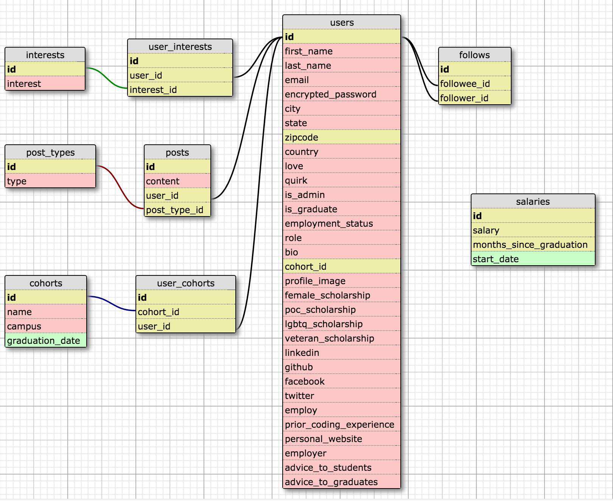

# BootBook

## Team Agreements
- Core Hours: 9AM - 9PM
- Daily 1 min Checkins
- Group dessert daily
- Group walks 1x day
- Join All Nighthawks Standup

## Core Product Values
- Preserving users' privacy
- Respecting users' attention

## MVP
- GitHub OAuth
- Detailed user profile page
- Mentoring/networking through direct private messaging

## Achieved Stretch-Goals
- Search and filter users by name, location, cohort, interests
- ActionMailer email on joining app and start of new conversations
- "Favoriting" other users
- Google Maps API to visualize distribution of users

## Remaining Stretch-Goals and Ideas
- Limiting Github authentication to members of Devbootcamp org and/or cohort orgs
- Open source administration of the app
- Posts (categorized and feeds)
- Admin dashboard for managing resources
- Collection of final projects, linked to team members' profiles
- Resources page curated by users in different categories (upvoteable)
- D3 data visualization of student/grad statistics (salary, time between graduation and first job)

# User Stories
- User can login through Github
- User receives an email when they join
- User can edit their own profile & see other users' profiles
- User can search for other users by name
- User can filter other users by location, cohort, interests
- User can direct message other users
- User can specify that a conversation is about mentoring or collaboration
- User receives an email when another user starts a conversation with them
- User can favorite other users

# Schema

