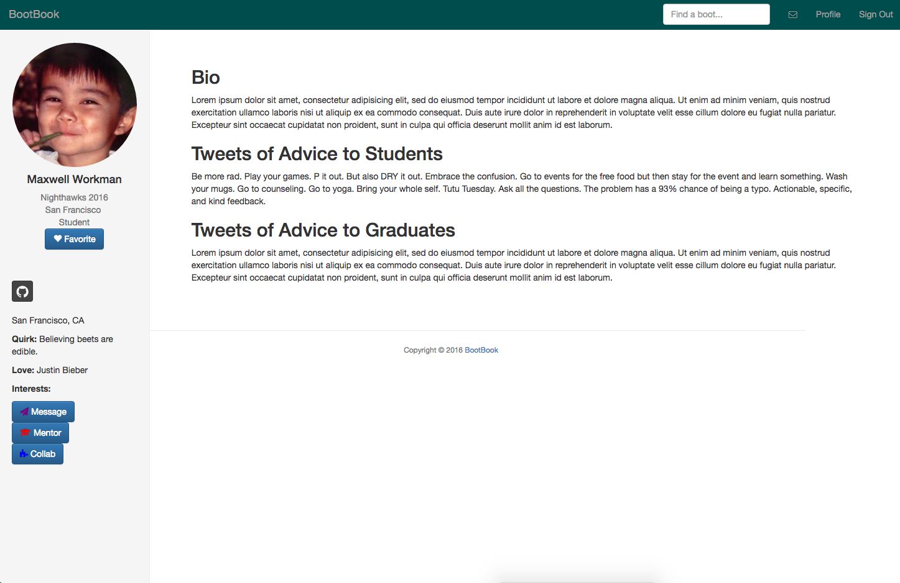
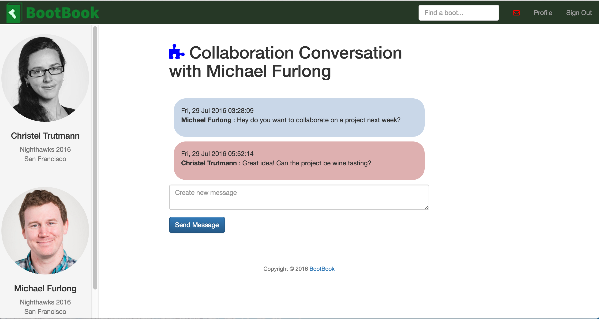

# BootBook
BootBook is a private social network for [**Dev Bootcamp**]('http://devbootcamp.com/') students and graduates, built to help boots connect across cohorts and campuses.

Filters make it easier to find mentors or collaborators with similar interests, while optional mentor/collab conversation buttons only show on a boot's profile if they have indicated that they are open to mentoring or collaborating. This alleviates much of the awkwardness of cold-contacting someone, while shielding boots from unwanted requests. Plain direct messaging is possible with each boot.

The Dev Bootcamp experience and culture uniquely prepares us to learn intensively, be emotionally intelligent in teams, and '*make beautiful, meaningful things*.' At the same time, getting through Dev Bootcamp and transitioning into the tech industry as a bootcamp grad are unique challenges. **BootBook** aims to leverage our strengths and reduce our anxieties by connecting us to fellow boots at every stage: from Phase 0 to professional web developer.

### Contributing
BootBook started as a final project of the 2016 San Francisco Nighthawks, but we hope to make it a friendly open source project that many current and future boots will contribute to.

Please read [CONTRIBUTING]('CONTRIBUTING') and our [CODE OF CONDUCT]('CODE_OF_CONDUCT') for more on the process of submitting pull requests to BootBook.

## Boot Stories
- Boot can sign in and create account through Github oauth.
- Boot receives an email when they join.
- Boot can edit their own profile & see other boots' profiles.
- Boot can search for other boots by name.
- Boot can filter other boots by location, cohort, interests.
- Boot can direct message other boots.
- Boot can specify that a conversation is about mentoring or collaboration.
- Boot can specify whether they are open to mentoring or collaborating.
- Boot receives an email when another boot starts a conversation with them.
- Boot can favorite other boots.

### Signed-In Boot's Profile

### Viewing Another Boot's Profile

### Searching/Filtering Other Boots

### Mapping Other Boots

### Starting a Conversation

## Future Goals
- Limiting authorization to members of Devbootcamp org and/or cohort orgs.
- Open source administration of the app.
- Continuous integration.
- Admin dashboard for managing resources.
- Posts (categorized as events, hackathon team invites, job opportunities, etc.) that are searchable, and streamed from favorited boots.
- Pair programming feature that makes it easier to find someone to learn with.
- Collection of final projects, linked to team members' profiles.
- Resources page curated by users in different categories (upvoteable).
- BootBook feedback feature where boots can suggest and vote on changes.
- D3 data visualization of student/grad statistics (salary, time between graduation and first job, demographic differences, etc.).
